# 🪐 Task Manager System - Enterprise Full-Stack Ecosystem

[](https://www.oracle.com/java/)
[](https://spring.io/projects/spring-boot)
[](https://react.dev/)
[](https://www.typescriptlang.org/)
[](https://tailwindcss.com/)
[](https://vitest.dev/)
[](https://oxc.rs/)
[](https://www.postgresql.org/)
[](https://www.docker.com/)

A modern, full-stack enterprise task management solution engineered for high reliability, responsiveness, and clean maintainability. Combines a **Spring Boot 4 / Java 17** backend adhering to **Hexagonal Architecture** with a high-performance **React 19 / Vite / Tailwind CSS v4** single-page application and **PostgreSQL**.

---

## 🏛️ Ecosystem Overview & Subprojects

This repository is organized as a unified multi-tier codebase containing two primary projects alongside root-level code quality automation:

| Subproject | Description | Stack | Documentation |
| :--- | :--- | :--- | :--- |
| **`task-manager/`** | RESTful backend API handling authentication, domain aggregates, database persistence, rate limiting, and OpenAPI specs. | Java 17, Spring Boot 4, Spring Security, JWT, PostgreSQL, Bucket4j | [Backend README](file:///Users/diegovilla/Desktop/task-manager-system/task-manager/README.md) |
| **`task-manager-client/`** | Single Page Application featuring interactive Kanban boards, dynamic filters, atomic UI design system, and JWT lifecycle management. | React 19, TypeScript, Vite 8, Tailwind CSS v4, `@hello-pangea/dnd`, Vitest | [Frontend README](file:///Users/diegovilla/Desktop/task-manager-system/task-manager-client/README.md) |

---

## 🚀 Full-Stack Architectural Runtime

```mermaid
flowchart LR
    subgraph Client ["Client Tier (React 19 SPA)"]
        UI["Atomic UI & Kanban Board"]
        Router["React Router 7"]
        Axios["Axios (JWT Interceptor + 401 Auto-Refresh)"]
        UI --> Router --> Axios
    end

    subgraph Backend ["Backend Tier (Spring Boot 4 API)"]
        RL["Bucket4j RateLimitingFilter"]
        Security["JwtAuthenticationFilter & SecurityConfig"]
        Controllers["REST Controllers (Auth, Task, User)"]
        Domain["Domain & Application Services"]
        JPA["Spring Data JPA & Specifications"]
        
        RL --> Security --> Controllers --> Domain --> JPA
    end

    subgraph Persistence ["Data Tier (PostgreSQL 16)"]
        DB[(Task Manager Database)]
        JPA --> DB
    end

    Axios -- "HTTP / REST (JSON & Bearer JWT)" --> RL
```



---

## 📁 Repository Directory Structure

```text
task-manager-system/
├── .husky/                             # Git pre-commit & commit-msg automated hooks
├── .commitlintrc.json                  # Conventional commits specification rules
├── .lintstagedrc.js                    # Staged file linting, formatting & test runner
├── docker-compose.yml                  # Multi-container orchestration definition
├── git-prune-branches.sh               # Utility script to clean up orphaned local Git branches
├── package.json                        # Root monorepo workspace dependencies & scripts
├── README.md                           # System root documentation
│
├── task-manager/                       # 🟢 Spring Boot Backend API
│   ├── pom.xml
│   ├── mvnw
│   ├── Dockerfile
│   ├── README.md
│   └── src/
│       ├── main/java/.../task_manager/
│       │   ├── core/                   # Security, JWT, Rate Limiting, Error Handling
│       │   ├── features/
│       │   │   ├── auth/               # Login, Register, Refresh Token
│       │   │   ├── task/               # Task Domain, Lifecycle, Specs & Endpoints
│       │   │   └── user/               # User Aggregate, Roles, Queries & Endpoints
│       │   └── utils/
│       └── test/                       # Unit and domain test suite (57+ tests)
│
└── task-manager-client/                # 🔵 React 19 Frontend SPA
    ├── package.json
    ├── vite.config.ts                  # Vite config with Vitest & path aliases
    ├── Dockerfile
    ├── README.md
    └── src/
        ├── core/                       # Axios, Interceptors, Guards, Router & Tests
        ├── features/
        │   ├── auth/                   # Login/Register UI, Auth Store & Services
        │   ├── tasks/                  # Kanban Drag-and-Drop, Tasks Tables, Modals
        │   └── users/                  # User Profile & Stats Hook
        └── shared/                     # Atomic UI, Hooks & Utility functions (76+ Tests)
```

---

## ⚡ Quickstart Guide

### Option A: Running with Docker Compose

Ensure Docker is running, then launch the infrastructure and API:

```bash
# 1. Create external docker network if not present
docker network create shared-network

# 2. Build and run containers
docker compose up --build -d
```

- **Backend API**: [http://localhost:8080](http://localhost:8080)
- **Frontend SPA**: [http://localhost:3000](http://localhost:3000)
- **Swagger UI**: [http://localhost:8080/swagger-ui.html](http://localhost:8080/swagger-ui.html)

---

### Option B: Running Locally in Development Mode

#### 1. Start the PostgreSQL Database
Ensure a local PostgreSQL instance is running with a database named `task_manager_db` on port `5432`.

#### 2. Start the Spring Boot Backend
```bash
cd task-manager
cp .env.example .env # or configure environment variables
./mvnw spring-boot:run
```
*Backend runs at:* [http://localhost:8080](http://localhost:8080)  
*Swagger Documentation:* [http://localhost:8080/swagger-ui.html](http://localhost:8080/swagger-ui.html)

#### 3. Start the React Frontend
```bash
cd ../task-manager-client
pnpm install
pnpm run dev
```
*Frontend runs at:* [http://localhost:3000](http://localhost:3000)

---

## 🔐 Default Credentials

Upon initial startup, the database seeder creates a default administrator account:

| Role | Email | Password |
| :--- | :--- | :--- |
| **Administrator** | `admin@taskmanager.com` | `12345678` |

---

## 🧪 Testing, Code Quality & Git Hooks

The repository enforces strict enterprise code quality standards via automated Git hooks:

### 🪝 Automated Git Hooks (Husky & lint-staged)
- **`pre-commit`**: Automatically runs Prettier formatting, `oxlint` static code analysis, and targeted `vitest related` unit tests with coverage on staged frontend files, as well as `./mvnw test` on modified backend Java files.
- **`commit-msg`**: Validates commit message adherence to [Conventional Commits](https://www.conventionalcommits.org/) (e.g. `feat:`, `fix:`, `chore:`, `test:`, `docs:`, `refactor:`).
- **`pre-push`**: Strictly validates that the Docker daemon is active and executes `docker compose build` to verify multi-container images build successfully before allowing commits to be pushed to remote.

### ☕ Backend Testing (Spring Boot)
```bash
cd task-manager

# Run Spring Boot Unit & Domain Tests (57 tests)
./mvnw test -Dtest="!TaskManagerApplicationTests"

# Generate Javadoc documentation
./mvnw javadoc:javadoc
```

### ⚛️ Frontend Testing & Linting (React Client)
```bash
cd task-manager-client

# Run 76 unit and integration tests across 25 suites
pnpm test:run

# Run tests in interactive watch mode
pnpm test

# Run tests with V8 code coverage report
pnpm test:coverage

# Launch interactive Vitest UI browser dashboard
pnpm test:ui

# Fast static code analysis with Oxlint
pnpm run lint

# Build production bundle with TypeScript type-checking
pnpm run build
```

---

## 🧹 Git Utility Scripts

### Branch Pruning Script (`git-prune-branches.sh`)

[git-prune-branches.sh](file:///Users/diegovilla/Desktop/task-manager-system/git-prune-branches.sh) is a utility script designed to keep the local repository clean by automatically pruning orphaned local branches whose remote tracking branches have been deleted or merged on GitHub/GitLab.

#### What it does
1. Runs `git fetch -p` (`prune`) to synchronize and purge stale remote references.
2. Identifies local branches marked with `: gone]` (whose upstream remote no longer exists), while protecting essential branches (`main`, `dev`, `qa`, `staging`).
3. Displays the list of detected branches and prompts for interactive confirmation (`y/N`) before deleting them (`git branch -D`).

#### How to use it

1. Make sure the script has execution permissions:
   ```bash
   chmod +x git-prune-branches.sh
   ```

2. Run the script from the root of the project:
   ```bash
   ./git-prune-branches.sh
   ```

---

> This digital ecosystem has been designed, structured, and developed to high-performance standards by **[Cabuweb](https://cabuweb.com)** - **Software Developer: Diego Villa**.
