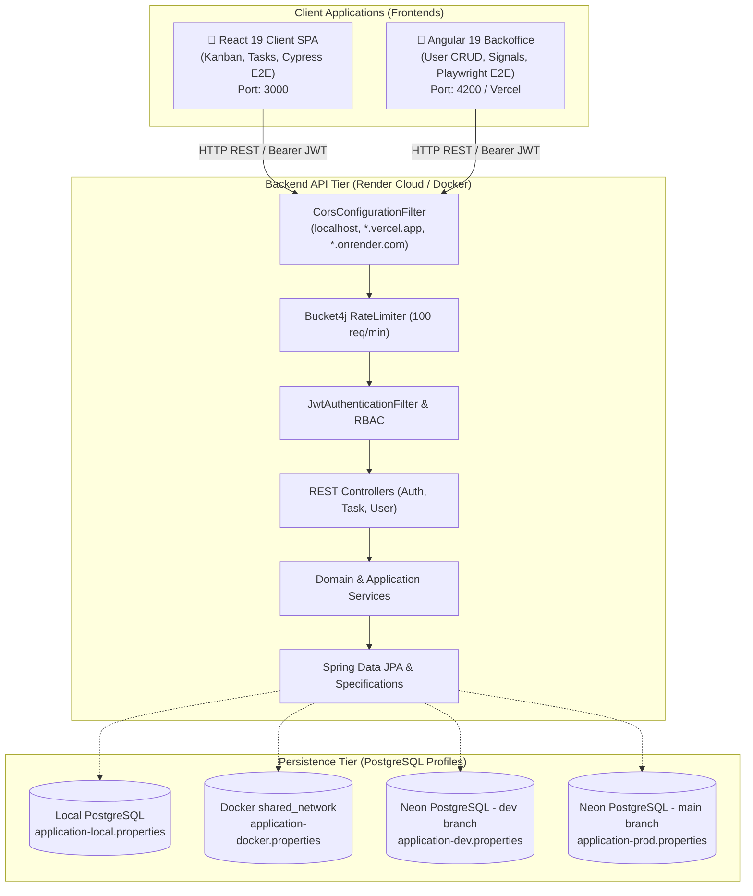
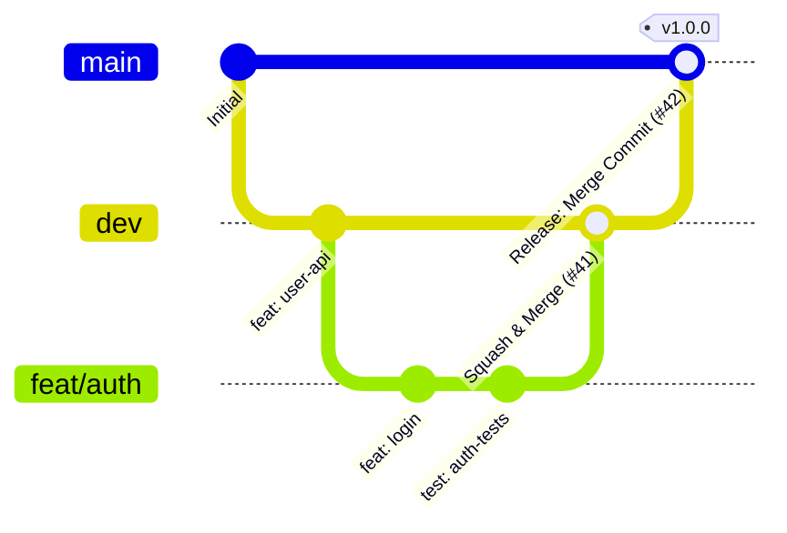

# 🪐 Task Manager System - Enterprise Full-Stack Ecosystem

[](https://www.oracle.com/java/)
[](https://spring.io/projects/spring-boot)
[](https://react.dev/)
[](https://angular.dev/)
[](https://nx.dev/)
[](https://pnpm.io/)
[](https://www.typescriptlang.org/)
[](https://tailwindcss.com/)
[](https://www.postgresql.org/)
[](https://www.docker.com/)
[](https://vercel.com/)
[](https://render.com/)

A modern, production-grade enterprise task management platform engineered for maximum reliability, speed, and clean architectural maintainability. Features a **Spring Boot 3 / Java 21** RESTful API, a **React 19 / Vite** client SPA with Cypress E2E, and an **Angular 19** Backoffice administration dashboard with Playwright E2E, orchestrated within a **pnpm + Nx Monorepo (Package-Based)**, backed by **Neon PostgreSQL**, **Docker**, and strict **CI/CD Quality Gates**.

---

## 🏛️ Ecosystem Architecture & Applications

The repository is structured as a unified **pnpm workspace** and **Nx Monorepo**, housing three specialized application tiers under `apps/` alongside cross-cutting automation:

| Application                         | Description                                                                                                           | Stack & Ports                                                              | Cloud Hosting & CD                                                | Documentation                                                                                                  |
| :---------------------------------- | :-------------------------------------------------------------------------------------------------------------------- | :------------------------------------------------------------------------- | :---------------------------------------------------------------- | :------------------------------------------------------------------------------------------------------------- |
| **`apps/task-manager/`**            | RESTful Backend API (Hexagonal Architecture, DDD, JWT Auth, Bucket4j Rate Limiting, OpenAPI, native Spring Profiles). | Java 21, Spring Boot 3, PostgreSQL<br>`Port: 8080`                         | **Render Cloud** (Dev & Prod Webhooks)<br>Database: **Neon.tech** | [Backend Docs](file:///Users/diegovilla/Desktop/task-manager-system/apps/task-manager/README.md)               |
| **`apps/task-manager-client/`**     | User-facing SPA with drag-and-drop Kanban board, dynamic filters, atomic UI design system, and Cypress E2E.           | React 19, Vite, Tailwind CSS v4, Vitest, Cypress<br>`Port: 3000`           | Static / Container ready                                          | [Client Docs](file:///Users/diegovilla/Desktop/task-manager-system/apps/task-manager-client/README.md)         |
| **`apps/task-manager-backoffice/`** | Admin Dashboard for user management (CRUD) and task analytics with TanStack Angular Query, Signals & Playwright E2E.  | Angular 19, TypeScript, Tailwind CSS v4, Karma, Playwright<br>`Port: 4200` | **Vercel** (Automatic Previews on PRs & Prod on `main`)           | [Backoffice Docs](file:///Users/diegovilla/Desktop/task-manager-system/apps/task-manager-backoffice/README.md) |

---

## 🚀 Full-Stack Architectural Runtime



---

## 📁 Repository Directory Structure

```text
task-manager-system/
├── .github/
│   ├── workflows/
│   │   ├── ci-cd-backend.yml           # Backend CI/CD (Spotless, Unit Tests, SonarCloud, Render Webhook)
│   │   ├── ci-frontend.yml             # React Client CI (Unit Tests, Build, Ephemeral Docker API + Cypress E2E)
│   │   └── ci-cd-backoffice.yml        # Angular CI/CD (Karma, Ephemeral Docker API + Playwright E2E, Vercel CD)
│   └── scripts/
│       └── notify-discord-summary.js   # Single consolidated Discord notification webhook
├── .husky/                             # Git pre-commit & pre-push hooks
├── .commitlintrc.json                  # Conventional Commits commit-msg validator
├── .lintstagedrc.js                    # Lint-staged runner for Prettier, ESLint & Spotless
├── docker-compose.yml                  # Multi-container local orchestration (Backend + React + Angular)
├── nx.json                             # Nx Monorepo configuration (defaultBase: dev, computation caching)
├── package.json                        # Monorepo root workspace orchestration scripts
├── pnpm-workspace.yaml                 # pnpm workspace definition (apps/*, packages/*, libs/*)
├── README.md                           # System root documentation
│
└── apps/
    ├── task-manager/                   # 🟢 Spring Boot Backend API
    │   ├── pom.xml
    │   ├── Dockerfile
    │   ├── project.json                # Nx targets for Maven wrapper
    │   ├── README.md
    │   └── src/main/resources/         # application.properties & profiles (local, docker, dev, prod)
    │
    ├── task-manager-client/            # 🔵 React 19 Frontend Client SPA
    │   ├── package.json
    │   ├── vite.config.ts
    │   ├── cypress.config.ts           # Cypress E2E test suite configuration
    │   ├── Dockerfile
    │   ├── README.md
    │   └── src/                        # Kanban, Auth, Tasks, Atomic UI components
    │
    └── task-manager-backoffice/        # 🅰️ Angular 19 Backoffice Dashboard
        ├── angular.json                # Multi-environment build configurations
        ├── package.json
        ├── playwright.config.ts        # Playwright E2E test runner configuration
        ├── vercel.json                 # SPA routing rewrite rules for Vercel
        ├── Dockerfile
        ├── README.md
        ├── e2e/                        # Playwright E2E test specs & Page Object Models
        └── src/                        # Standalone Components, TanStack Query, Signals, Environments
```

---

## ⚡ Quickstart & Monorepo Development

The workspace leverages **pnpm** and **Nx** for parallel task execution and intelligent computation caching:

### 1. Prerequisites

- **Node.js**: `v22+`
- **pnpm**: `v10+` (or `v11`)
- **Java**: OpenJDK `21`
- **Docker & Docker Compose**: latest

### 2. Installation & Workspace Setup

```bash
# Clone the repository
git clone https://github.com/DiegoVilla27/task-manager-system.git
cd task-manager-system

# Install all workspace dependencies
pnpm install
```

### 3. Launching Microservices

You can run services independently or concurrently using Nx:

```bash
# Start individual applications
pnpm start:server       # Starts Spring Boot API via Maven Wrapper (Port: 8080)
pnpm start:client       # Starts React 19 Client SPA via Vite (Port: 3000)
pnpm start:backoffice   # Starts Angular 19 Backoffice via Angular CLI (Port: 4200)

# Run tasks across all projects simultaneously
pnpm build:all          # Build backend JAR and all frontend production bundles
pnpm test:all           # Run tests across Java, React, and Angular with Nx caching

# Nx Affected execution (only tests/builds code modified against dev branch)
pnpm affected:test
pnpm affected:build
pnpm affected:lint

# Explore interactive dependency graph
pnpm graph
```

---

## 🐳 Containerized Orchestration with Docker Compose

Run the complete multi-service stack with a single command:

```bash
# 1. Create external shared Docker network (if not already created)
docker network create shared-network || true

# 2. Build and launch all services in background
pnpm docker:up
# Or directly: docker compose up -d --build

# Inspect real-time container logs
pnpm docker:logs

# Stop containers
pnpm docker:down
```

### Service Routing & Endpoints:

| Service                | Local URL                                                                                                      | Target Profile / Configuration              | Description                                        |
| :--------------------- | :------------------------------------------------------------------------------------------------------------- | :------------------------------------------ | :------------------------------------------------- |
| **Spring Boot API**    | [http://localhost:8080/api/v1](http://localhost:8080/api/v1)                                                   | `SPRING_PROFILES_ACTIVE=docker`             | Backend REST API (`application-docker.properties`) |
| **Swagger UI**         | [http://localhost:8080/api/v1/api-docs/swagger-ui.html](http://localhost:8080/api/v1/api-docs/swagger-ui.html) | Open standard                               | Interactive OpenAPI 3.0 Documentation              |
| **React Client**       | [http://localhost:3000](http://localhost:3000)                                                                 | `VITE_API_URL=http://localhost:8080/api/v1` | Task Manager Client SPA                            |
| **Angular Backoffice** | [http://localhost:4200](http://localhost:4200)                                                                 | `environment.local.ts`                      | Admin Backoffice Dashboard                         |

---

## 🌐 Database & Environment Profiles

The Spring Boot backend uses native Spring Profiles to cleanly decouple database configurations:

| Profile                 | Configuration File              | Database URL                                             | Target Use Case                             |
| :---------------------- | :------------------------------ | :------------------------------------------------------- | :------------------------------------------ |
| **`local`** _(default)_ | `application-local.properties`  | `jdbc:postgresql://localhost:5432/task_manager_db`       | Local machine execution without Docker      |
| **`docker`**            | `application-docker.properties` | `jdbc:postgresql://global_postgres:5432/task_manager_db` | Docker Compose & CI/CD ephemeral containers |
| **`dev`**               | `application-dev.properties`    | Neon Serverless PostgreSQL (`dev` branch)                | Cloud Development on Render                 |
| **`prod`**              | `application-prod.properties`   | Neon Serverless PostgreSQL (`main` branch)               | Cloud Production on Render                  |

---

## 🛡️ GitFlow, Rulesets & Branching Strategy

The repository strictly enforces automated Quality Gates via GitHub Rulesets to prevent regressions:



### Rulesets Configuration:

1. **`dev` (Development Branch):**
   - Direct push blocked.
   - Merge strategy: **Squash and Merge** (keeps commit history atomic and clean).
   - Mandatory CI Quality Gates (Format, Lint, Tests, E2E, SonarCloud).
2. **`main` (Production Branch):**
   - Direct push blocked.
   - Merge strategy: **Create a Merge Commit** (preserves genealogy and avoids conflict divergence).
   - Mandatory CI/CD Quality Gates + Automated Cloud Deployments.

---

## ⚡ Continuous Integration & Deployment (CI/CD)

Every Pull Request and Push is evaluated through strict Quality Gates before code can be merged or deployed:

### 1. Backend Pipeline (`ci-cd-backend.yml`):

- **Checks:** Spotless Google Java Format, Maven clean compile, Unit & Domain Tests (JaCoCo report), Production JAR packaging, SonarCloud Quality Gate.
- **Continuous Deployment (CD):** Dispatches Render Deploy Webhooks (`RENDER_DEPLOY_HOOK_DEV` on `dev`, `RENDER_DEPLOY_HOOK_PROD` on `main`).

### 2. React Client Pipeline (`ci-frontend.yml`):

- **Checks:** Prettier, ESLint, TypeScript typecheck, Vitest unit & component tests, Production bundle verification.
- **Full-Stack E2E:** Boots an ephemeral `postgres:15-alpine` container + `docker compose up -d --build spring-api` and runs **Cypress E2E** against the live API.

### 3. Angular Backoffice Pipeline (`ci-cd-backoffice.yml`):

- **Checks:** Prettier, ESLint, TypeScript typecheck, 164 Jasmine/Karma unit tests (98%+ coverage), Production build verification, SonarCloud Quality Gate.
- **Full-Stack E2E:** Boots an ephemeral `postgres:15-alpine` container + `docker compose up -d --build spring-api` and runs **Playwright E2E** tests against the live API.
- **Continuous Deployment (CD):** Deploys to **Vercel** (Dynamic Preview URL on PRs, Production Deployment on `main`).

### 4. Consolidated Discord Notifications:

- Every pipeline execution sends a single, rich embedded summary card to Discord reporting the status of every Quality Gate check and cloud deployment.

---

## 🛠️ Root Workspace Scripts

Execute commands from the repository root:

```bash
# Code Quality & Format Checks
pnpm run format:check      # Check formatting across all subprojects (TS, HTML, CSS, JSON, Java)
pnpm run format:write      # Auto-format all files across workspace
pnpm run lint              # Run ESLint across frontends

# Clean local orphaned Git branches
./git-prune-branches.sh
```

---

## 📄 License

This project is licensed under the MIT License.

> This digital ecosystem has been designed, structured, and developed to high-performance standards by **[Cabuweb](https://cabuweb.com)** - **Software Developer: Diego Villa**.
