# 🪐 Task Manager System - Enterprise Full-Stack Ecosystem

[](https://www.oracle.com/java/)
[](https://spring.io/projects/spring-boot)
[](https://react.dev/)
[](https://www.typescriptlang.org/)
[](https://tailwindcss.com/)
[](https://www.postgresql.org/)
[](https://www.docker.com/)

A modern, full-stack enterprise task management solution engineered for high reliability, responsiveness, and clean maintainability. Combines a **Spring Boot 4 / Java 17** backend adhering to **Hexagonal Architecture** with a high-performance **React 19 / Vite / Tailwind CSS v4** single-page application and **PostgreSQL**.

---

## 🏛️ Ecosystem Overview & Subprojects

This repository is organized as a unified multi-tier codebase containing two primary projects:

| Subproject | Description | Stack | Documentation |
| :--- | :--- | :--- | :--- |
| **`task-manager/`** | RESTful backend API handling authentication, domain aggregates, database persistence, rate limiting, and OpenAPI specs. | Java 17, Spring Boot 4, Spring Security, JWT, PostgreSQL, Bucket4j | [Backend README](file:///Users/diegovilla/Desktop/task-manager-system/task-manager/README.md) |
| **`task-manager-client/`** | Single Page Application featuring interactive Kanban boards, dynamic filters, atomic UI design system, and JWT lifecycle management. | React 19, TypeScript, Vite 8, Tailwind CSS v4, `@hello-pangea/dnd` | [Frontend README](file:///Users/diegovilla/Desktop/task-manager-system/task-manager-client/README.md) |

---

## 🚀 Full-Stack Architectural Runtime

```mermaid
flowchart LR
    subgraph Client ["Client Tier (React 19 SPA)"]
        UI["Atomic UI & Kanban Board"]
        Router["React Router 7"]
        Axios["Axios (JWT Interceptor + 401 Auto-Refresh)"]
        UI --> Router --> Axios
    end

    subgraph Backend ["Backend Tier (Spring Boot 4 API)"]
        RL["Bucket4j RateLimitingFilter"]
        Security["JwtAuthenticationFilter & SecurityConfig"]
        Controllers["REST Controllers (Auth, Task, User)"]
        Domain["Domain & Application Services"]
        JPA["Spring Data JPA & Specifications"]
        
        RL --> Security --> Controllers --> Domain --> JPA
    end

    subgraph Persistence ["Data Tier (PostgreSQL 16)"]
        DB[(Task Manager Database)]
        JPA --> DB
    end

    Axios -- "HTTP / REST (JSON & Bearer JWT)" --> RL
```



---

## 📁 Repository Directory Structure

```text
task-manager-system/
├── docker-compose.yml                  # Multi-container orchestration definition
├── README.md                           # System root documentation
│
├── task-manager/                       # 🟢 Spring Boot Backend API
│   ├── pom.xml
│   ├── mvnw
│   ├── Dockerfile
│   ├── README.md
│   └── src/
│       ├── main/java/.../task_manager/
│       │   ├── core/                   # Security, JWT, Rate Limiting, Error Handling
│       │   ├── features/
│       │   │   ├── auth/               # Login, Register, Refresh Token
│       │   │   ├── task/               # Task Domain, Lifecycle, Specs & Endpoints
│       │   │   └── user/               # User Aggregate, Roles, Queries & Endpoints
│       │   └── utils/
│       └── test/                       # Unit and domain test suite
│
└── task-manager-client/                # 🔵 React 19 Frontend SPA
    ├── package.json
    ├── vite.config.ts
    ├── README.md
    └── src/
        ├── core/                       # Axios, Interceptors, Guards, Router
        ├── features/
        │   ├── auth/                   # Login/Register UI, Auth Store & Services
        │   ├── tasks/                  # Kanban Drag-and-Drop, Tasks Tables, Modals
        │   └── users/                  # User Profile & Stats Hook
        └── shared/                     # Atomic UI, Hooks & Utility functions
```

---

## ⚡ Quickstart Guide

### Option A: Running with Docker Compose

Ensure Docker is running, then launch the infrastructure and API:

```bash
# 1. Create external docker network if not present
docker network create shared-network

# 2. Build and run containers
docker-compose up --build -d
```

### Option B: Running Locally in Development Mode

#### 1. Start the PostgreSQL Database
Ensure a local PostgreSQL instance is running with a database named `task_manager_db` on port `5432`.

#### 2. Start the Spring Boot Backend
```bash
cd task-manager
cp .env.example .env # or configure environment variables
./mvnw spring-boot:run
```
*Backend runs at:* [http://localhost:8080](http://localhost:8080)  
*Swagger Documentation:* [http://localhost:8080/swagger-ui.html](http://localhost:8080/swagger-ui.html)

#### 3. Start the React Frontend
```bash
cd ../task-manager-client
npm install
npm run dev
```
*Frontend runs at:* [http://localhost:5173](http://localhost:5173)

---

## 🔐 Default Credentials

Upon initial startup, the database seeder creates a default administrator account:

| Role | Email | Password |
| :--- | :--- | :--- |
| **Administrator** | `admin@taskmanager.com` | `12345678` |

---

## 🧪 Testing & Code Quality

```bash
# Run Spring Boot Unit Tests (57 tests)
cd task-manager
./mvnw test -Dtest="!TaskManagerApplicationTests"

# Generate Javadoc
./mvnw javadoc:javadoc

# Run React Client Linting
cd ../task-manager-client
npm run lint

# Build React Client Bundle
npm run build
```

---

> This digital ecosystem has been designed, structured, and developed to high-performance standards by **[Cabuweb](https://cabuweb.com)**.
