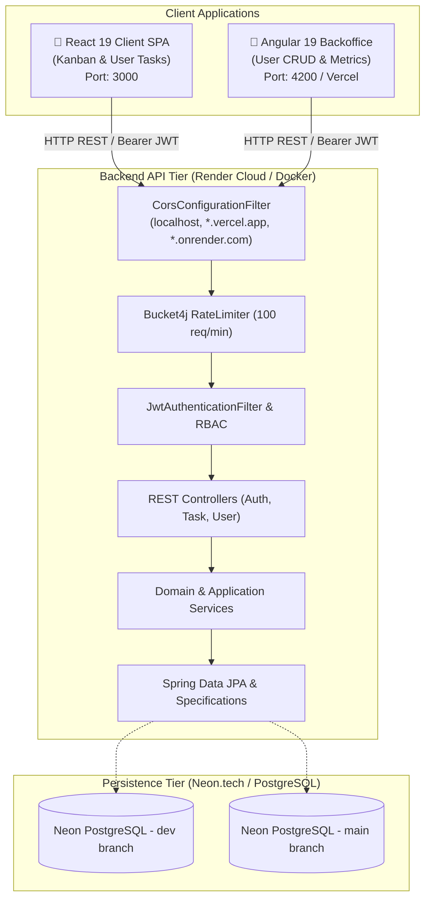
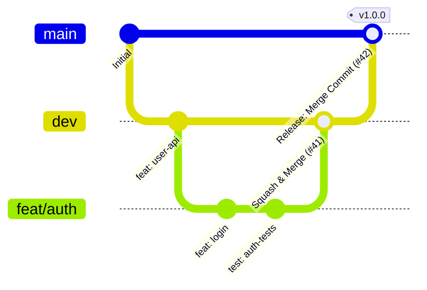

# 🪐 Task Manager System - Enterprise Full-Stack Ecosystem

[](https://www.oracle.com/java/)
[](https://spring.io/projects/spring-boot)
[](https://react.dev/)
[](https://angular.dev/)
[](https://www.typescriptlang.org/)
[](https://tailwindcss.com/)
[](https://www.postgresql.org/)
[](https://www.docker.com/)
[](https://vercel.com/)
[](https://render.com/)

A modern, production-grade enterprise task management platform engineered for maximum reliability, speed, and clean architectural maintainability. Features a **Spring Boot 3 / Java 21** RESTful API, a **React 19 / Vite** client SPA, and an **Angular 19** Backoffice administration dashboard, backed by **Neon PostgreSQL**, **Docker**, and strict **CI/CD Quality Gates**.

---

## 🏛️ Ecosystem Architecture & Subprojects

The repository is structured as a unified monorepo housing three specialized application tiers and cross-cutting automation:

| Subproject | Description | Stack & Ports | Cloud Hosting & CD | Documentation |
| :--- | :--- | :--- | :--- | :--- |
| **`task-manager/`** | RESTful Backend API (Hexagonal Architecture, DDD, JWT Auth, Bucket4j Rate Limiting, OpenAPI). | Java 21, Spring Boot 3, PostgreSQL<br>`Port: 8080` | **Render Cloud** (Dev & Prod Hooks)<br>Database: **Neon.tech** | [Backend Docs](file:///Users/diegovilla/Desktop/task-manager-system/task-manager/README.md) |
| **`task-manager-client/`** | User-facing SPA with drag-and-drop Kanban board, filters, atomic UI design system, and JWT lifecycle. | React 19, Vite, Tailwind CSS v4, Vitest<br>`Port: 3000` | Static / Container ready | [Client Docs](file:///Users/diegovilla/Desktop/task-manager-system/task-manager-client/README.md) |
| **`task-manager-backoffice/`** | Admin Dashboard for user management (CRUD) and task analytics with TanStack Angular Query & Signals. | Angular 19, TypeScript, Tailwind CSS v4, Karma<br>`Port: 4200` | **Vercel** (Automatic Previews on PRs & Prod on `main`) | [Backoffice Docs](file:///Users/diegovilla/Desktop/task-manager-system/task-manager-backoffice/README.md) |

---

## 🚀 Full-Stack Architectural Runtime



---

## 📁 Repository Directory Structure

```text
task-manager-system/
├── .github/
│   ├── workflows/
│   │   ├── ci-cd-backend.yml           # Backend CI/CD (Quality Gate + Render Deploy Hooks)
│   │   └── ci-cd-backoffice.yml        # Angular CI/CD (Quality Gate + Vercel CD Deploy)
│   └── scripts/
│       └── notify-discord-summary.js   # Single consolidated Discord notification webhook
├── .husky/                             # Git pre-commit & pre-push hooks
├── .commitlintrc.json                  # Conventional Commits commit-msg validator
├── .lintstagedrc.js                    # Lint-staged runner for Prettier, ESLint & Spotless
├── docker-compose.yml                  # Multi-container local orchestration (Backend + React + Angular)
├── package.json                        # Monorepo root scripts & dev dependencies
├── README.md                           # System root documentation
│
├── task-manager/                       # 🟢 Spring Boot Backend API
│   ├── pom.xml
│   ├── Dockerfile
│   ├── README.md
│   └── src/main/java/...               # Core (Security, CORS, JWT, OpenAPI), Features (Auth, Task, User)
│
├── task-manager-client/                # 🔵 React 19 Frontend Client SPA
│   ├── package.json
│   ├── vite.config.ts
│   ├── Dockerfile
│   ├── README.md
│   └── src/                            # Kanban, Auth, Tasks, Atomic UI components
│
└── task-manager-backoffice/            # 🅰️ Angular 19 Backoffice Dashboard
    ├── angular.json                    # Multi-environment build configurations
    ├── package.json
    ├── vercel.json                     # SPA routing rewrite rules for Vercel
    ├── Dockerfile
    ├── README.md
    └── src/                            # Standalone Components, TanStack Query, Signals, Environments
```

---

## 🐳 Local Development with Docker Compose

Run the entire ecosystem (Backend API, React Client, Angular Backoffice) with a single command:

```bash
# 1. Create external shared Docker network (if not existing)
docker network create shared-network || true

# 2. Build and launch all 3 micro-services in the background
docker compose up -d --build
```

### Active Service Endpoints:

| Service | Local URL | Description |
| :--- | :--- | :--- |
| **Spring Boot API** | [http://localhost:8080/api/v1](http://localhost:8080/api/v1) | Backend REST API |
| **Swagger UI** | [http://localhost:8080/swagger-ui.html](http://localhost:8080/swagger-ui.html) | Interactive OpenAPI Documentation |
| **React Client** | [http://localhost:3000](http://localhost:3000) | Task Manager Client SPA |
| **Angular Backoffice** | [http://localhost:4200](http://localhost:4200) | Admin Backoffice Dashboard |

---

## 🛡️ GitFlow, Rulesets & Branching Strategy

The repository strictly enforces automated Quality Gates via GitHub Rulesets to prevent regressions:



### Rulesets Configuration:

1. **`dev` (Development Branch):**
   - Direct push blocked.
   - Merge strategy: **Squash and Merge** (keeps history atomic and clean).
   - Mandatory CI Quality Gates (Format, Lint, Tests, SonarCloud).
2. **`main` (Production Branch):**
   - Direct push blocked.
   - Merge strategy: **Create a Merge Commit** (preserves genealogy and avoids conflict divergence).
   - Mandatory CI/CD Quality Gates + Automatic Cloud Deployments.

---

## ⚡ Continuous Integration & Deployment (CI/CD)

Every Pull Request and Push is evaluated through strict Quality Gates before code can be merged or deployed:

### 1. Backend Pipeline (`ci-cd-backend.yml`):
- **Checks:** Spotless Google Java Format, Maven compile, 57+ Unit & Domain Tests, SonarCloud Quality Gate.
- **Continuous Deployment (CD):** Calls Render Deploy Webhooks (`RENDER_DEPLOY_HOOK_DEV` on `dev`, `RENDER_DEPLOY_HOOK_PROD` on `main`).

### 2. Angular Backoffice Pipeline (`ci-cd-backoffice.yml`):
- **Checks:** Prettier, ESLint, TypeScript typecheck, 164 Jasmine/Karma unit tests (98%+ coverage), Production build verification, SonarCloud Quality Gate.
- **Continuous Deployment (CD):** Deploys to **Vercel** (Dynamic Preview URL on PRs, Production Deployment on `main`).

### 3. Consolidated Discord Notifications:
- Every pipeline execution sends a single, rich embedded summary card to Discord reporting the status of every Quality Gate check and cloud deployment.

---

## 🛠️ Root Workspace Scripts

Run standard commands from the repository root:

```bash
# Code Quality & Format Checks
pnpm run format:check      # Check formatting across all subprojects
pnpm run format:write      # Auto-format all TS/HTML/CSS/JSON/Java files
pnpm run lint              # Run ESLint across frontends

# Clean local orphaned Git branches
./git-prune-branches.sh
```

---

## 📄 License

This project is licensed under the MIT License.
