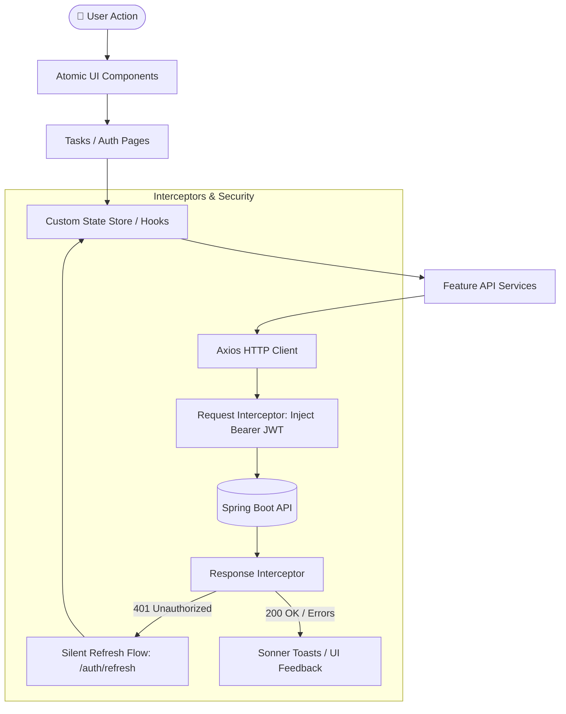

# ⚛️ Task Manager Client - React 19 Frontend

[](https://react.dev/)
[](https://nx.dev/)
[](https://www.typescriptlang.org/)
[](https://vitejs.dev/)
[](https://tailwindcss.com/)
[](https://reactrouter.com/)
[](https://vitest.dev/)
[](https://www.cypress.io/)
[](https://www.docker.com/)

A modern, responsive, high-performance Single Page Application (SPA) for task lifecycle management. Built with **React 19**, **TypeScript**, **Tailwind CSS v4**, and **Vite 8**, featuring an interactive **Kanban Board** with drag-and-drop, rich filtering, atomic UI design system, robust JWT token interceptor renewal, strict schema validation, Vitest unit & integration suites, and **Cypress E2E** automated tests against the live Spring Boot API.

Integrated within the root **Nx Monorepo** as `task-manager-client`.

---

## 📖 Core Features & Capabilities

- **Interactive Kanban Board**: Visual workflow organization with drag-and-drop status transitions (`PENDING`, `IN_PROGRESS`, `COMPLETED`) powered by `@hello-pangea/dnd`.
- **Alternative Table & List Views**: Tabular task management with inline status toggles, deletion confirmation dialogs, and editing capabilities.
- **Dynamic Search & Filters**: Debounced keyword filtering and status facet filters for instant client-side responsive querying.
- **Authentication & Security**:
  - Full authentication lifecycle (Login, Registration, Logout).
  - Private & Public route guards (`AuthenticatedGuard`, `PublicGuard`).
  - Axios HTTP Interceptors with transparent, silent 401 token refresh queueing.
- **Atomic UI Design System**: Handcrafted accessible UI component library (Buttons, Modals, Badges, Inputs, Skeletons, Dropdowns, Tables) utilizing `clsx` and `tailwind-merge`.
- **Form Management**: Strongly typed forms managed via `react-hook-form` and validated using `zod` schemas.
- **Toast Notifications**: Smooth visual notifications and error alerts powered by `sonner`.
- **Comprehensive Testing Strategy**:
  - Unit and integration testing with **Vitest** and **React Testing Library** (76+ tests).
  - Full-stack End-to-End (E2E) testing with **Cypress** running against ephemeral Docker backend instances.

---

## 🚀 Runtime Flow & State Architecture



---

## 📁 Directory Structure

```text
apps/task-manager-client/
├── index.html
├── package.json
├── vite.config.ts                      # Vite configuration with Vitest & path aliases
├── cypress.config.ts                   # Cypress E2E test runner configuration
├── Dockerfile                          # Alpine Node.js 22 containerization
├── cypress/                            # Cypress E2E specs & support commands
│   ├── e2e/                            # End-to-end user journeys & tests
│   └── fixtures/                       # Mock payloads & test fixtures
├── src/
│   ├── main.tsx                       # React DOM root entrypoint
│   ├── index.css                      # Tailwind CSS v4 core directives & custom theme
│   ├── setupTests.ts                  # Vitest & Jest DOM matcher configuration
│   ├── core/                          # Cross-cutting application infrastructure
│   │   ├── axios/                     # Axios instance base configuration
│   │   ├── environments/              # API URLs and environment resolution
│   │   ├── guards/                    # Route protection guards (Public / Private)
│   │   ├── interceptors/              # Request JWT injection & 401 refresh interceptor
│   │   └── router/                    # React Router 7 route definitions & guards
│   ├── features/                      # Domain feature modules
│   │   ├── auth/                      # Login, Register, Session Store & Auth Services
│   │   ├── tasks/                     # Kanban Drag-and-Drop, Tasks Tables, Modals
│   │   │   ├── components/            # Kanban board, Task cards, Filters, Modals
│   │   │   ├── hooks/                 # Custom domain hooks & filter logic
│   │   │   ├── services/              # Task API endpoints integration
│   │   │   └── store/                 # Modal & UI state store
│   │   └── users/                     # User profile lookup & services
│   └── shared/                        # Atomic design system & utilities
│       ├── components/ui/             # Avatar, Badge, Button, Input, Modal, Select, Table
│       ├── hooks/                     # Generic reusable hooks (useDebounce, etc.)
│       └── utils/                     # Formatting & class merging helpers
```

---

## ⚙️ Environment Configuration

Environment files configure backend connectivity targets:

```env
# .env.localhost (Used for local & Docker development)
VITE_API_URL=http://localhost:8080/api/v1

# .env.dev (Points to Render Dev API)
VITE_API_URL=https://task-manager-api-dev-cgwm.onrender.com/api/v1

# .env.prod (Points to Render Prod API)
VITE_API_URL=https://task-manager-api-prod-j45b.onrender.com/api/v1
```

---

## 🛠️ Local Development & Scripts

### Running with Nx from Monorepo Root:

```bash
# Start development server
pnpm start:client
# Or: nx dev task-manager-client

# Run Vitest test suite
nx test task-manager-client

# Build production bundle
nx build task-manager-client
```

### Running inside `apps/task-manager-client/`:

```bash
# Install dependencies
pnpm install

# Start against Local Backend (Port: 3000)
pnpm run local

# Start against Render Dev Cloud API
pnpm run dev

# Start against Render Prod Cloud API
pnpm run prod

# Run Vitest test suites
pnpm test                  # Run tests once
pnpm run test:watch        # Interactive watch mode
pnpm run test:coverage     # Generate coverage report

# Run Cypress E2E tests
pnpm run e2e               # Headless E2E execution
pnpm run e2e:open          # Interactive Cypress Test Runner UI

# Code Quality
pnpm run typecheck         # Strict TypeScript validation
pnpm run lint              # Fast oxlint inspection
pnpm run format:check      # Check Prettier formatting
pnpm run format:write      # Auto-format all files
```

---

## 🐳 Docker Deployment

The client is containerized using Node 22 Alpine:

```bash
# Build and run client container
docker build -t task-manager-client .
docker run -p 3000:3000 task-manager-client

# Or orchestrated via Docker Compose from root:
docker compose up -d --build react-client
```

---

## 🚀 CI/CD Pipeline (`ci-frontend.yml`)

The React Client pipeline validates quality and tests end-to-end against live infrastructure:

1. **Static Quality Gate**: TypeScript `tsc -b`, Prettier format verification, and oxlint.
2. **Unit & Integration Testing**: Vitest suite with code coverage assertions.
3. **Full-Stack E2E Quality Gate**:
   - Boots an isolated PostgreSQL database (`global_postgres`) and the Spring Boot API inside GitHub Actions.
   - Executes the complete **Cypress E2E** test suite in headless Chrome against `http://localhost:3000`.
   - Captures automated screenshots and dumps Docker container logs if a failure occurs.

---

> This digital ecosystem has been designed, structured, and developed to high-performance standards by **[Cabuweb](https://cabuweb.com)** - **Software Developer: Diego Villa**.
