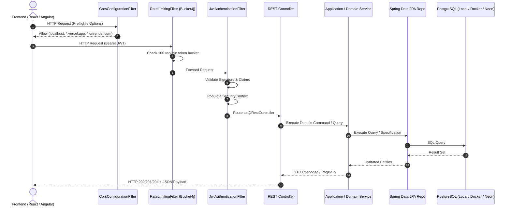

# 🚀 Task Manager API - Spring Boot Backend

[](https://www.oracle.com/java/)
[](https://spring.io/projects/spring-boot)
[](https://nx.dev/)
[](https://neon.tech/)
[](https://jwt.io/)
[](https://github.com/diffplug/spotless)
[](http://localhost:8080/api/v1/api-docs/swagger-ui.html)
[](https://render.com/)

High-performance, secure RESTful API powering the Task Manager ecosystem. Built with **Spring Boot 3 / Java 21**, following **Hexagonal / Clean Architecture (DDD)** principles, stateless dual-token JWT security, Bucket4j rate limiting, dynamic JPA criteria querying, Spotless code formatting, native Spring multi-profile configurations, and automated deployment to **Render Cloud**.

Integrated within the root **Nx Monorepo** as `task-manager-server`.

---

## 📖 Core Architectural Highlights

- **Hexagonal Architecture & DDD**: Strict separation into `core` (cross-cutting concerns, security, error handling) and `features` (`auth`, `task`, `user`).
- **Stateless JWT Security**: Short-lived access tokens and HMAC-signed refresh tokens managed via custom `OncePerRequestFilter` and Spring Security 6 RBAC (`ROLE_ADMIN`, `ROLE_USER`).
- **Native Spring Profiles**: Environment-specific configurations for Local (`local`), Docker containers (`docker`), Cloud Staging (`dev`), and Cloud Production (`prod`).
- **Cloud Database (Neon.tech)**: Serverless PostgreSQL persistence using isolated database branches for `dev` and `main` (Prod).
- **Resilient Rate Limiting**: In-memory token-bucket rate limiter via **Bucket4j** (100 requests/minute per client IP) defending against DoS and brute-force attacks.
- **Dynamic Criteria Specifications**: Advanced search, filtering, sorting, and pagination via Spring Data JPA Specifications and Hibernate Formula subqueries.
- **Enterprise Error Handling**: RFC-7807 compliant error responses with custom `ApiException` hierarchy, Bean Validation translations, and database constraint mapping.
- **Spotless Google Java Format**: Automated code formatting enforced on commit and CI/CD pipelines.

---

## 🌐 Environments & Cloud Endpoints

The API is deployed on **Render Cloud** with zero-downtime Continuous Deployment:

| Environment              | Base URL                                                 | Swagger UI Documentation                                                                           | Database Target                               |
| :----------------------- | :------------------------------------------------------- | :------------------------------------------------------------------------------------------------- | :-------------------------------------------- |
| **Local Machine**        | `http://localhost:8080/api/v1`                           | [Local Swagger UI](http://localhost:8080/api/v1/api-docs/swagger-ui.html)                          | Local PostgreSQL (`localhost:5432`)           |
| **Docker Compose**       | `http://localhost:8080/api/v1`                           | [Docker Swagger UI](http://localhost:8080/api/v1/api-docs/swagger-ui.html)                         | Container PostgreSQL (`global_postgres:5432`) |
| **Development (Render)** | `https://task-manager-api-dev-cgwm.onrender.com/api/v1`  | [Dev Swagger UI](https://task-manager-api-dev-cgwm.onrender.com/api/v1/api-docs/swagger-ui.html)   | Neon PostgreSQL (`dev` branch)                |
| **Production (Render)**  | `https://task-manager-api-prod-j45b.onrender.com/api/v1` | [Prod Swagger UI](https://task-manager-api-prod-j45b.onrender.com/api/v1/api-docs/swagger-ui.html) | Neon PostgreSQL (`main` branch)               |

---

## 🏗️ System Architecture & Runtime Flow



---

## 📁 Directory Structure

```text
apps/task-manager/
├── pom.xml                                    # Maven dependencies & build configuration
├── project.json                               # Nx targets mapping Maven wrapper commands
├── Dockerfile                                 # Multi-stage container build (Eclipse Temurin 21 JRE)
├── mvnw / mvnw.cmd                            # Maven Wrapper
└── src/
    ├── main/
    │   ├── java/com/diegovilla/task_manager/
    │   │   ├── TaskManagerApplication.java    # Spring Boot entrypoint
    │   │   ├── core/                          # Cross-cutting concerns & infrastructure
    │   │   │   ├── annotations/               # Custom Bean Validation annotations
    │   │   │   ├── errors/                    # RFC-7807 error models, handlers & factories
    │   │   │   ├── openapi/                   # OpenAPI 3.0 configuration & Swagger servers
    │   │   │   └── security/                  # Spring Security, JWT, CORS & Bucket4j Rate Limiting
    │   │   ├── features/                      # Business domain features
    │   │   │   ├── auth/                      # Login, Register, Refresh Token commands
    │   │   │   ├── task/                      # Task aggregate, lifecycle, specs & endpoints
    │   │   │   └── user/                      # User aggregate, roles, specs & endpoints
    │   │   └── utils/                         # String and data formatting utilities
    │   └── resources/
    │       ├── application.properties         # Common configuration (Swagger, JWT defaults, active profile)
    │       ├── application-local.properties   # Local PostgreSQL configuration (localhost:5432)
    │       ├── application-docker.properties  # Docker container configuration (global_postgres:5432)
    │       ├── application-dev.properties     # Neon Cloud Dev PostgreSQL
    │       └── application-prod.properties    # Neon Cloud Prod PostgreSQL
    └── test/                                  # Comprehensive unit & domain test suite (57+ tests)
```

---

## ⚙️ Spring Profiles & Configuration

Spring Boot uses native profiles. Set `spring.profiles.active` via CLI arguments or environment variables:

### Profile Details:

| Profile      | Datasource URL                                              | Default Credentials    | Usage                             |
| :----------- | :---------------------------------------------------------- | :--------------------- | :-------------------------------- |
| **`local`**  | `jdbc:postgresql://localhost:5432/task_manager_db`          | `user` / `password`    | Local bare-metal development      |
| **`docker`** | `jdbc:postgresql://global_postgres:5432/task_manager_db`    | `user` / `password`    | Docker Compose & CI/CD containers |
| **`dev`**    | `jdbc:postgresql://ep-***.neon.tech/neondb?sslmode=require` | Managed via properties | Render Cloud Dev                  |
| **`prod`**   | `jdbc:postgresql://ep-***.neon.tech/neondb?sslmode=require` | Managed via properties | Render Cloud Prod                 |

### Switching Profiles Manually:

```bash
# Run with Local Profile (Default)
./mvnw spring-boot:run

# Run with Docker Profile
./mvnw spring-boot:run -Dspring-boot.run.profiles=docker

# Run with Dev Profile (Neon Cloud)
./mvnw spring-boot:run -Dspring-boot.run.profiles=dev

# Or pass via environment variable:
SPRING_PROFILES_ACTIVE=dev ./mvnw spring-boot:run
```

---

## 🛠️ Development Commands

### Running with Nx from Monorepo Root:

```bash
# Start backend server
pnpm start:server
# Or: nx dev task-manager-server

# Run unit tests
nx test task-manager-server

# Build production JAR package
nx build task-manager-server

# Verify and format code
nx format task-manager-server
```

### Running with Maven Wrapper directly inside `apps/task-manager/`:

```bash
# Start server
./mvnw spring-boot:run

# Run all 57+ unit and domain tests
./mvnw test

# Verify Spotless Google Java Format
./mvnw spotless:check

# Auto-format Java code with Spotless
./mvnw spotless:apply

# Build production JAR package
./mvnw clean package -DskipTests
```

---

## 🐳 Docker Deployment

The service is packaged using a multi-stage Alpine build with **Eclipse Temurin 21 JRE**:

```bash
# Build Docker image directly
docker build -t task-manager-api .

# Run container connected to shared network
docker run -d \
  --name spring_api \
  --network shared-network \
  -e SPRING_PROFILES_ACTIVE=docker \
  -p 8080:8080 \
  task-manager-api
```

---

## 🚀 CI/CD Pipeline (`ci-cd-backend.yml`)

The backend pipeline automates verification and cloud deployments on GitHub Actions:

1. **Change Detection**: Analyzes git paths to trigger only when files in `apps/task-manager/**` change.
2. **Quality Gate**:
   - `Spotless Check`: Enforces Google Java Format.
   - `Maven Compilation`: Validates Java 21 bytecode.
   - `Unit & Domain Tests`: Runs 57 tests with Surefire and produces JaCoCo reports.
   - `SonarCloud Scan`: Analyzes code quality, test coverage, and security hotspots.
3. **Continuous Deployment (CD)**:
   - On `dev` push ➔ Triggers Render Dev Deploy Webhook (`RENDER_DEPLOY_HOOK_DEV`).
   - On `main` push ➔ Triggers Render Production Deploy Webhook (`RENDER_DEPLOY_HOOK_PROD`).
4. **Discord Notification**: Sends a rich embedded status report upon completion.

---

> This digital ecosystem has been designed, structured, and developed to high-performance standards by **[Cabuweb](https://cabuweb.com)** - **Software Developer: Diego Villa**.
