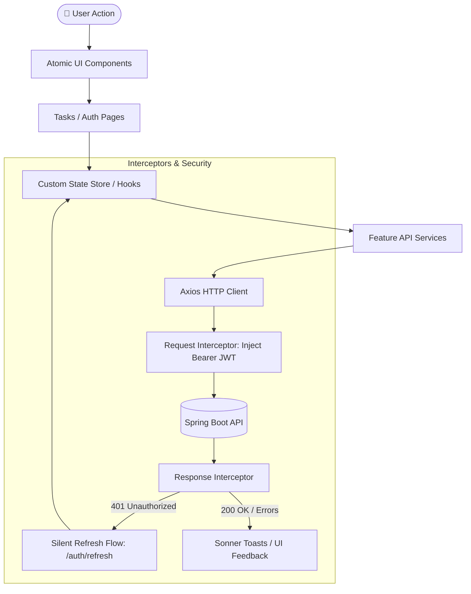

# ⚛️ Task Manager Client - React 19 Frontend

[](https://react.dev/)
[](https://www.typescriptlang.org/)
[](https://vitejs.dev/)
[](https://tailwindcss.com/)
[](https://reactrouter.com/)

A modern, responsive, high-performance Single Page Application (SPA) for task lifecycle management. Built with **React 19**, **TypeScript**, **Tailwind CSS v4**, and **Vite 8**, featuring an interactive **Kanban Board** with drag-and-drop, rich filtering, atomic UI design system, robust JWT token interceptor renewal, and strict schema validation.

---

## 📖 Core Features & Capabilities

- **Interactive Kanban Board**: Visual workflow organization with drag-and-drop status transitions (`PENDING`, `IN_PROGRESS`, `COMPLETED`) powered by `@hello-pangea/dnd`.
- **Alternative Table & List Views**: Fast tabular task management with inline status toggles, deletion confirmation dialogs, and editing capabilities.
- **Dynamic Search & Filters**: Debounced keyword filtering and status facet filters for instant client-side responsive querying.
- **Authentication & Security**:
  - Full authentication lifecycle (Login, Registration, Logout).
  - Private & Public route guards (`AuthenticatedGuard`, `PublicGuard`).
  - Axios HTTP Interceptors with transparent, silent 401 token refresh queueing.
- **Atomic UI Design System**: Handcrafted accessible UI component library (Buttons, Modals, Badges, Inputs, Skeletons, Dropdowns) utilizing `clsx` and `tailwind-merge`.
- **Form Management**: Strongly typed forms managed via `react-hook-form` and validated using `zod` schemas.
- **Toast Notifications**: Smooth visual notifications and error alerts powered by `sonner`.

---

## 🚀 Runtime Flow & State Architecture



---

## 📁 Directory Structure

```text
task-manager-client/
├── index.html
├── package.json
├── vite.config.ts
├── tsconfig.json
└── src/
    ├── main.tsx
    ├── index.css
    ├── core/
    │   ├── axios/                     # Axios instance base configuration
    │   ├── environments/              # App environment variables & base URLs
    │   ├── guards/                    # Route protection guards (Public / Private)
    │   ├── http/                      # Base HTTP client wrappers
    │   ├── interceptors/              # Request JWT injection & 401 refresh interceptor
    │   └── router/                    # React Router definitions and route trees
    ├── features/
    │   ├── auth/                      # Login, Register, Session Store & Auth Services
    │   │   ├── interfaces/
    │   │   ├── layout/
    │   │   ├── pages/
    │   │   ├── services/
    │   │   └── store/
    │   ├── tasks/                     # Task management domain & Kanban UI
    │   │   ├── api/
    │   │   ├── components/            # Kanban board, Task cards, Task modals
    │   │   ├── layouts/
    │   │   ├── models/
    │   │   ├── pages/
    │   │   ├── services/
    │   │   ├── store/
    │   │   └── utils/
    │   └── users/                     # User profile lookup & services
    └── shared/
        ├── components/
        │   └── ui/                    # Modal, Button, Input, Skeleton, Badge, etc.
        ├── hooks/                     # Custom hooks (useMe, useDebounce)
        └── utils/                     # Class merging (cn), localStorage adapters
```

---

## 🛠️ Technical Stack & Dependencies

| Category | Library / Dependency | Version | Purpose |
| :--- | :--- | :--- | :--- |
| **Framework** | `react` & `react-dom` | `^19.2.8` | Core UI rendering engine |
| **Language** | `typescript` | `~6.0.2` | Static type system |
| **Build Tool**| `vite` | `^8.2.0` | Next-generation frontend tooling |
| **Styling** | `tailwindcss` | `^4.3.3` | Utility-first CSS engine |
| **Routing** | `react-router-dom` | `^7.18.2` | Declarative client routing |
| **Drag & Drop**| `@hello-pangea/dnd`| `^18.0.1` | Smooth accessible Kanban drag-and-drop |
| **HTTP Client**| `axios` | `^1.19.0` | Promise-based HTTP client with interceptors |
| **Validation**| `zod` | `^4.4.3` | TypeScript-first schema declaration & validation |
| **Forms** | `react-hook-form` | `^7.85.0` | High-performance form state management |
| **Icons** | `lucide-react` | `^1.31.0` | Modern customizable SVG icons |
| **Toasts** | `sonner` | `^2.0.8` | Opinionated, accessible toast notifications |
| **Utilities**| `clsx` & `tailwind-merge` | `^2.1.1` / `^3.6.0` | Dynamic CSS class merging |

---

## ⚙️ Provisioning & Setup Guide

### 1. Prerequisites
- **Node.js**: v18.x or higher
- **npm** or **pnpm** installed

### 2. Environment Configuration
Create a `.env` file in `task-manager-client/`:

```env
VITE_API_URL=http://localhost:8080
```

### 3. Installation & Development

```bash
# Install project dependencies
npm install

# Start Vite development server
npm run dev

# Lint codebase with oxlint
npm run lint

# Build production bundle with typechecking
npm run build

# Preview production build locally
npm run preview
```

The application will be accessible at:  
👉 **Local Web Client**: [http://localhost:5173](http://localhost:5173)

---

> This digital ecosystem has been designed, structured, and developed to high-performance standards by **[Cabuweb](https://cabuweb.com)**.
