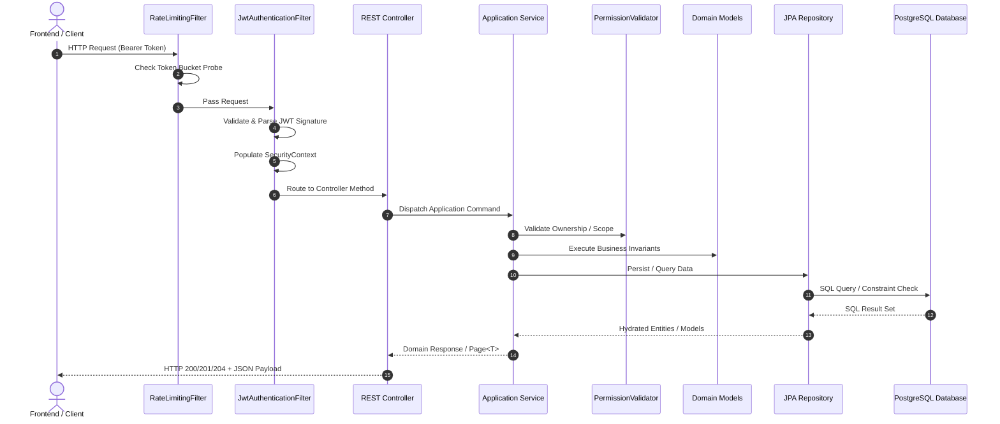

# 🚀 Task Manager API - Spring Boot Backend

[](https://www.oracle.com/java/)
[](https://spring.io/projects/spring-boot)
[](https://www.postgresql.org/)
[](https://jwt.io/)
[](http://localhost:8080/swagger-ui.html)

Robust, high-performance RESTful API powering the Task Manager platform. Built with **Spring Boot 4 / Java 17**, following **Hexagonal / Clean Architecture (DDD)** principles, secure stateless JWT authentication with refresh token lifecycle, client-aware Bucket4j rate limiting, dynamic JPA criteria querying, and comprehensive OpenAPI 3.0 documentation.

---

## 📖 Core Architectural Highlights

- **Hexagonal / Clean Architecture**: Strict separation of concerns divided into `domain`, `application`, and `infrastructure` layers.
- **Stateless JWT Security**: Dual-token strategy with short-lived access tokens and HMAC-signed refresh tokens, coupled with custom `OncePerRequestFilter` filters and role-based access control (`ROLE_ADMIN`, `ROLE_USER`).
- **Resilient Rate Limiting**: In-memory token-bucket rate limiter via **Bucket4j**, defending endpoints against denial of service and abusive traffic patterns.
- **Dynamic Criteria Queries**: Advanced filtering, search, and pagination powered by Spring Data JPA Specifications and Hibernate Formula subqueries.
- **Enterprise Error Handling**: Centralized exception resolution with custom domain hierarchy (`ApiException`), automated SQL/relational constraint translations, and standardized RFC-7807 compliant error responses.
- **Interactive OpenAPI / Swagger**: Complete API specifications with rich schema definitions, paginated collection responses (`Page<T>`), and live execution via Swagger UI.

---

## 🏗️ System Architecture & Runtime Flow



---

## 📁 Directory Structure

```text
task-manager/
├── pom.xml
├── mvnw
├── mvnw.cmd
├── Dockerfile
└── src/
    ├── main/
    │   ├── java/com/diegovilla/task_manager/
    │   │   ├── TaskManagerApplication.java
    │   │   ├── core/
    │   │   │   ├── annotations/
    │   │   │   │   └── atleastonefield/       # Custom Bean Validation constraints
    │   │   │   ├── errors/
    │   │   │   │   ├── dto/                   # Error and field violation response DTOs
    │   │   │   │   ├── exceptions/            # ApiException domain hierarchy
    │   │   │   │   ├── factories/             # Structured error response factories
    │   │   │   │   ├── handlers/              # Spring & Domain ControllerAdvice handlers
    │   │   │   │   ├── resolvers/             # Dynamic Jackson format message resolvers
    │   │   │   │   └── translators/           # SQL and database constraint translators
    │   │   │   ├── openapi/
    │   │   │   │   └── common/                # Reusable OpenAPI error annotations
    │   │   │   └── security/
    │   │   │       ├── SecurityConfig.java    # Spring Security filter chain definition
    │   │   │       ├── cors/                  # Cross-Origin Resource Sharing filter
    │   │   │       ├── jwt/                   # JWT generation, validation & auth filter
    │   │   │       ├── ratelimit/             # Bucket4j rate limiting filter & service
    │   │   │       └── seeders/               # Startup database admin seeder
    │   │   ├── features/
    │   │   │   ├── auth/                      # Authentication domain, commands & controllers
    │   │   │   ├── task/                      # Task aggregate, lifecycle, commands & endpoints
    │   │   │   └── user/                      # User aggregate, roles, specs & endpoints
    │   │   └── utils/
    │   │       └── data/                      # String normalization & validation utils
    │   └── resources/
    │       ├── application.properties
    │       └── application.yml
    └── test/                                  # Comprehensive unit & domain test suite
```

---

## 🛠️ Technical Stack & Dependencies

| Category | Component / Library | Version | Purpose |
| :--- | :--- | :--- | :--- |
| **Runtime** | Java OpenJDK | `17` | Language standard runtime |
| **Framework** | Spring Boot | `4.1.0` | Core enterprise application framework |
| **Web MVC** | Spring WebMVC | `7.0.8` | MVC web layer |
| **Security** | Spring Security | `7.0.0-M1` | Stateless authentication & authorization |
| **JWT** | JJWT (io.jsonwebtoken) | `0.13.0` | Access & Refresh Token generation/parsing |
| **Rate Limiting** | Bucket4j Core | `8.19.0` | In-memory token bucket rate limiting |
| **Persistence** | Spring Data JPA / Hibernate | Spring Boot default | ORM, queries & formula subqueries |
| **Database Driver**| PostgreSQL JDBC Driver | `42.7.5` | Production relational database driver |
| **API Docs** | Springdoc OpenAPI UI | `3.0.3` | OpenAPI 3.0 specification & Swagger UI |
| **Mapping** | MapStruct | `1.6.3` | High-speed compile-time entity/DTO mapper |
| **Tooling** | Lombok | `1.18.46` | Boilerplate reduction (getters, constructors) |
| **Env Loader** | Java Dotenv | `3.2.0` | Local `.env` parameter loader |
| **Testing** | JUnit 5 & Mockito | Spring Boot default | Unit, domain, and mocking tests |

---

## 📡 REST API Endpoints Overview

### 🔐 Authentication (`/auth`)
| Method | Endpoint | Description | Auth Required |
| :--- | :--- | :--- | :--- |
| `POST` | `/auth/login` | Authenticate with email & password to obtain tokens | ❌ Public |
| `POST` | `/auth/register` | Register a new user account | ❌ Public |
| `POST` | `/auth/refresh` | Renew an expired access token using a refresh token | ❌ Public |

### 👤 Users (`/users`)
| Method | Endpoint | Description | Auth Required |
| :--- | :--- | :--- | :--- |
| `GET` | `/users/me` | Retrieve profile and stats of currently authenticated user | 🔒 Yes |
| `GET` | `/users` | Paginated search and list of all users with task counts | 🔒 Admin only |
| `GET` | `/users/{id}` | Retrieve specific user details by UUID | 🔒 Yes (Owner/Admin) |
| `POST` | `/users` | Create user account via administrative interface | 🔒 Admin only |
| `PATCH`| `/users/{id}` | Partially update profile details | 🔒 Yes (Owner/Admin) |
| `DELETE`| `/users/{id}`| Delete user (with optional `?force=true` cascade) | 🔒 Yes (Owner/Admin) |

### 📋 Tasks (`/tasks`)
| Method | Endpoint | Description | Auth Required |
| :--- | :--- | :--- | :--- |
| `GET` | `/tasks` | Paginated and filtered tasks (`status`, `search`, `userId`) | 🔒 Yes |
| `GET` | `/tasks/{id}` | Retrieve specific task with user association | 🔒 Yes (Owner/Admin) |
| `POST` | `/tasks` | Create a new task (assigned to authenticated user) | 🔒 Yes |
| `PATCH`| `/tasks/{id}` | Partially update task title or description | 🔒 Yes (Owner/Admin) |
| `PATCH`| `/tasks/{id}/start` | Transition task status from `PENDING` to `IN_PROGRESS` | 🔒 Yes (Owner/Admin) |
| `PATCH`| `/tasks/{id}/complete` | Transition task status to `COMPLETED` | 🔒 Yes (Owner/Admin) |
| `DELETE`| `/tasks/{id}` | Permanently delete a task | 🔒 Yes (Owner/Admin) |

---

## ⚙️ Provisioning & Setup Guide

### 1. Prerequisites
- **JDK 17** installed and configured (`JAVA_HOME`).
- **PostgreSQL 14+** running locally or in Docker.

### 2. Environment Variables (`.env`)
Create a `.env` file in the root of `task-manager/`:

```env
POSTGRES_DB=task_manager_db
POSTGRES_USER=postgres
POSTGRES_PASSWORD=postgres
POSTGRES_HOST=localhost
POSTGRES_PORT=5432
POSTGRES_URL=jdbc:postgresql://${POSTGRES_HOST}:${POSTGRES_PORT}/${POSTGRES_DB}

# JWT Token Configuration
SECURITY_JWT_SECRET=super_secret_access_key_min_32_characters_long_12345
SECURITY_JWT_EXP_SECRET=3600
SECURITY_JWT_REFRESH=super_secret_refresh_key_min_32_characters_long_67890
SECURITY_JWT_EXP_REFRESH=604800

# Rate Limiting Configuration
RATE_LIMITING_ENABLED=true
RATE_LIMITING_CAPACITY=60
RATE_LIMITING_REFILL_TOKENS=60
RATE_LIMITING_REFILL_MINUTES=1
```

### 3. Build and Run

```bash
# Compile and run unit tests
./mvnw clean test -Dtest="!TaskManagerApplicationTests"

# Generate complete Javadoc documentation
./mvnw javadoc:javadoc

# Run Spring Boot application locally
./mvnw spring-boot:run
```

Once running, access the interactive API docs at:
👉 **Swagger UI**: [http://localhost:8080/swagger-ui.html](http://localhost:8080/swagger-ui.html)  
👉 **OpenAPI JSON**: [http://localhost:8080/api-docs](http://localhost:8080/api-docs)

---

> This digital ecosystem has been designed, structured, and developed to high-performance standards by **[Cabuweb](https://cabuweb.com)** - **Software Developer: Diego Villa**.
