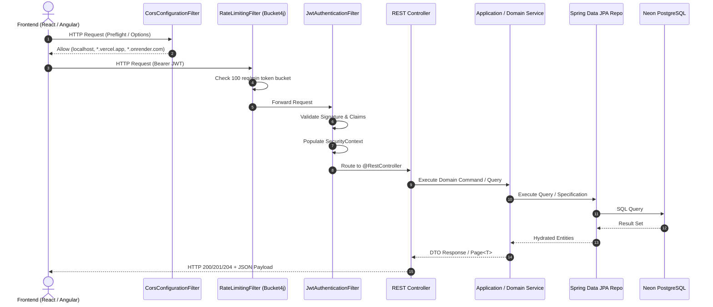

# 🚀 Task Manager API - Spring Boot Backend

[](https://www.oracle.com/java/)
[](https://spring.io/projects/spring-boot)
[](https://neon.tech/)
[](https://jwt.io/)
[](https://github.com/diffplug/spotless)
[](http://localhost:8080/swagger-ui.html)
[](https://render.com/)

High-performance, secure RESTful API powering the Task Manager ecosystem. Built with **Spring Boot 3 / Java 21**, following **Hexagonal / Clean Architecture (DDD)** principles, stateless dual-token JWT security, Bucket4j rate limiting, dynamic JPA criteria querying, Spotless code formatting, and automated deployment to **Render Cloud**.

---

## 📖 Core Architectural Highlights

- **Hexagonal Architecture & DDD**: Strict separation into `core` (cross-cutting concerns, security, error handling) and `features` (`auth`, `task`, `user`).
- **Stateless JWT Security**: Short-lived access tokens and HMAC-signed refresh tokens managed via custom `OncePerRequestFilter` and Spring Security 6 RBAC (`ROLE_ADMIN`, `ROLE_USER`).
- **Cloud Database (Neon.tech)**: Serverless PostgreSQL persistence using isolated database branches for `dev` and `main` (Prod).
- **Resilient Rate Limiting**: In-memory token-bucket rate limiter via **Bucket4j** (100 requests/minute per client IP) defending against DoS and brute-force attacks.
- **Dynamic Criteria Specifications**: Advanced search, filtering, sorting, and pagination via Spring Data JPA Specifications and Hibernate Formula subqueries.
- **Enterprise Error Handling**: RFC-7807 compliant error responses with custom `ApiException` hierarchy, Bean Validation translations, and database constraint mapping.
- **Spotless Google Java Format**: Automated code formatting enforced on commit and CI/CD pipelines.

---

## 🌐 Environments & Cloud Endpoints

The API is deployed on **Render Cloud** with zero-downtime Continuous Deployment:

| Environment | Base URL | Swagger UI Documentation | Database |
| :--- | :--- | :--- | :--- |
| **Local** | `http://localhost:8080/api/v1` | [http://localhost:8080/swagger-ui.html](http://localhost:8080/swagger-ui.html) | Local PostgreSQL / Docker |
| **Development (Render)** | `https://task-manager-api-dev-cgwm.onrender.com/api/v1` | [Dev Swagger UI](https://task-manager-api-dev-cgwm.onrender.com/swagger-ui.html) | Neon PostgreSQL (`dev` branch) |
| **Production (Render)** | `https://task-manager-api-prod-j45b.onrender.com/api/v1` | [Prod Swagger UI](https://task-manager-api-prod-j45b.onrender.com/swagger-ui.html) | Neon PostgreSQL (`main` branch) |

---

## 🏗️ System Architecture & Runtime Flow



---

## 📁 Directory Structure

```text
task-manager/
├── pom.xml                                    # Maven dependencies & build configuration
├── Dockerfile                                 # Multi-stage container build (Eclipse Temurin 21 JRE)
├── mvnw / mvnw.cmd                            # Maven Wrapper
└── src/
    ├── main/
    │   ├── java/com/diegovilla/task_manager/
    │   │   ├── TaskManagerApplication.java
    │   │   ├── core/                          # Cross-cutting concerns & infrastructure
    │   │   │   ├── annotations/               # Custom Bean Validation annotations
    │   │   │   ├── errors/                    # RFC-7807 error models, handlers & factories
    │   │   │   ├── openapi/                   # OpenAPI 3.0 configuration & Swagger servers
    │   │   │   └── security/                  # Spring Security, JWT, CORS & Bucket4j Rate Limiting
    │   │   ├── features/                      # Business domain features
    │   │   │   ├── auth/                      # Login, Register, Refresh Token commands
    │   │   │   ├── task/                      # Task aggregate, lifecycle, specs & endpoints
    │   │   │   └── user/                      # User aggregate, roles, specs & endpoints
    │   │   └── utils/                         # String and data formatting utilities
    │   └── resources/
    │       ├── application.properties
    │       └── application.yml                # Spring profile configurations
    └── test/                                  # Comprehensive unit & domain test suite (57+ tests)
```

---

## ⚙️ Environment Variables

Create a `.env` file inside `task-manager/` for local execution:

```properties
# Server
PORT=8080
SPRING_PROFILES_ACTIVE=dev

# Database Configuration
POSTGRES_URL=jdbc:postgresql://localhost:5432/task_manager_db
POSTGRES_USER=postgres
POSTGRES_PASSWORD=postgres

# Security & JWT
JWT_SECRET=your_super_secret_256_bit_jwt_key_here_must_be_long_enough
JWT_ACCESS_EXPIRATION_MS=900000        # 15 minutes
JWT_REFRESH_EXPIRATION_MS=604800000    # 7 days

# Admin Seeder
ADMIN_EMAIL=admin@taskmanager.com
ADMIN_PASSWORD=AdminPassword123!
```

---

## 🛠️ Local Development & Commands

```bash
# Compile and run locally
./mvnw spring-boot:run

# Run all 57+ unit and domain tests
./mvnw test

# Verify Spotless Google Java Format
./mvnw spotless:check

# Auto-format Java code with Spotless
./mvnw spotless:apply

# Build production JAR package
./mvnw clean package -DskipTests
```

---

## 🚀 CI/CD Pipeline (`ci-cd-backend.yml`)

The backend pipeline automates verification and cloud deployments:

1. **Change Detection**: Analyzes git paths to trigger only on backend modifications.
2. **Quality Gate**:
   - `Spotless Check`: Enforces Google Java Format.
   - `Maven Compilation`: Validates Java 21 bytecode.
   - `Unit & Domain Tests`: Runs 57 tests with Surefire.
   - `SonarCloud Scan`: Analyzes code quality, test coverage, and vulnerabilities.
3. **Continuous Deployment (CD)**:
   - On `dev` merge ➔ Triggers Render Dev Deploy Webhook.
   - On `main` merge ➔ Triggers Render Production Deploy Webhook.
4. **Discord Notification**: Sends embedded status reports on completion.
